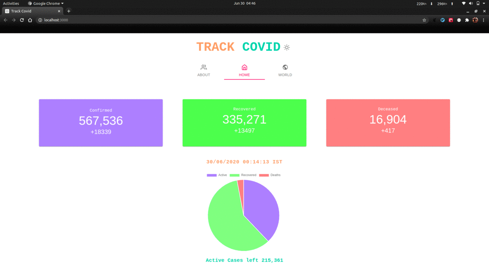

[](http://hits.dwyl.io/priyanshumay/badges)
[](http://makeapullrequest.com)
[](https://lbesson.mit-license.org/)
[](https://github.com/ellerbrock/open-source-badges/)
<p align="center" >

<br><br>

</p>

## Setup

```bash

git clone https://github.com/PriyanshuMay/track-covid.git && cd track-covid
npm i && npm start

```
## Hosted on Netlify

## Help to make this CRA-PWA better
 
* [Contributing Guide](CONTRIBUTING.md)
